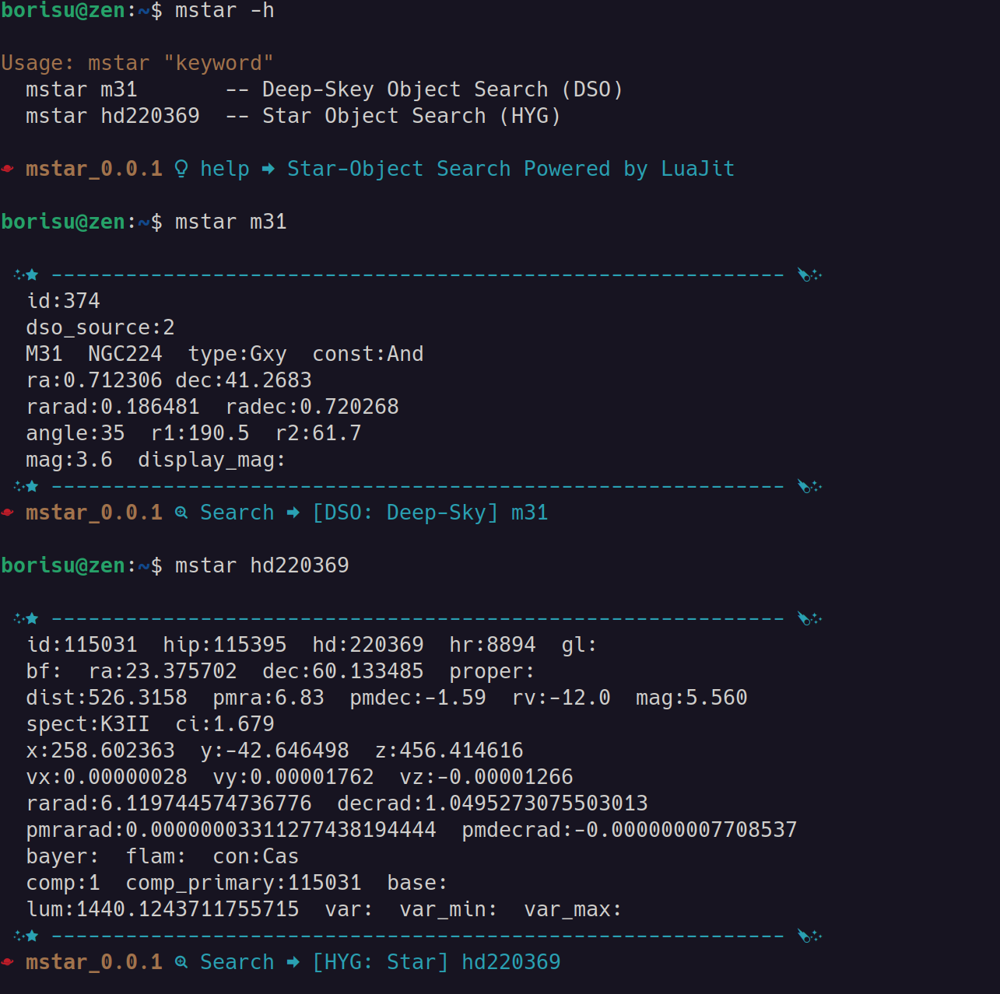

# mstar - Luajit star search tool

## Intro

* Small luajit script program
* Quick star object Search (Using: grep api)
* Linux base command line Star search program
* Star database : HYG-Data(Star Object), DSO-Data(Deep-Skey Object)
* Fancy Nerd font icons and colored terminal display
* No dependency except `luajit`
* Portable

## Star DataBase
It's all from astronexus github: Thanks to  
<https://github.com/astronexus/HYG-Database>

## Requirement

* on `Linux` or `unix` base system
* `luajit-2.1`
* `Nerd Font` on Terminal

## Install

```console
$ sudo apt install luajit
```

```console
$ cd
$ git clone https://github.com/neosolaris/mstar.git
$ cd mstar/
$ ./setup.sh --help
$ ./setup.sh install # create shellscript command to 'bin/mstar'
$ export PATH=$PATH:$HOME/mstar/bin
$ mstar -h
```

## Usage

```console
Usage: mstar m31      -- deep-skey search (m,ngc...) HYG
       mstar hd22036  -- star search (hd,hip,hr...) DSO
```

## Screen Shot


## TODO

* Static View
* More Detailed Search Options
* [o] 2022-10-24: First Version 0.0.1 Upload
